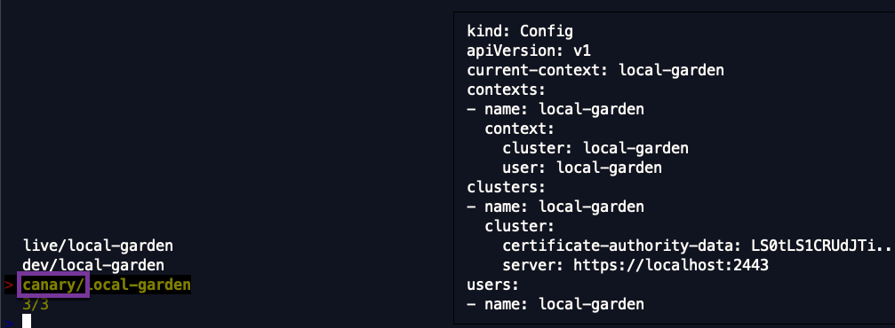
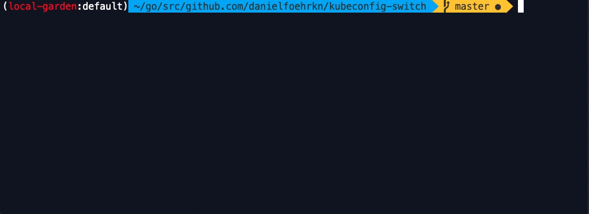

# Kubeswitch

The `kubectx` build for many kubeconfigs.
Kubeswitch (short: `switch`) is a tiny standalone tool, designed to conveniently switch between the context of thousands of `kubeconfig` files.

## Highlights

- **Efficient search**
  - stores a pre-computed index of kube-context names to speed up future searches
  - recursive directory search
  - hot reload capability (adds kubeconfigs to the search on the fly - especially useful when initially searching large directories)
- **Configurable Kubeconfig store**
  - Local filesystem
  - Hashicorp Vault 
- **Improved search experience** when dealing with many kubeconfigs
  - Live preview of the kubeconfig file (**sanitized from credentials**).
  - Kubeconfig context names are easily identifiable. The `context` is prefixed with the (immediate) parent folder name to allow to easily find the context you are looking for. 
  - Same fuzzy search capability known from `kubectx`
- **Terminal Window isolation**
  - Each terminal window can target a different cluster (does not override the current-context in a shared kubeconfig).
  - Each terminal window can target the same cluster and set a [different namespace preference](https://kubernetes.io/docs/concepts/overview/working-with-objects/namespaces/#setting-the-namespace-preference) 
  e.g via the tool [kubens](https://github.com/ahmetb/kubectx).
- **Extensibility** 
  - Integrate custom functionality using [Hooks](./hooks/README.md) (comparable with Git pre-commit hooks).


## Non-goals

- Anything else but efficient searching and switching of Kubeconfig contexts. 
  This includes the ability to change Kubernetes namespaces. Use another tool e.g. [kubens](https://github.com/ahmetb/kubectx/blob/master/kubens).

## Installation

Mac users can just use `homebrew` for installation.

If you are running Linux, you would need to first compile the `switcher` binary for Linux yourself, put it in your path, and then source the `switch` script from [here](https://github.com/danielfoehrKn/kubeconfig-switch/blob/master/hack/switch/switch.sh).

#### Option 1 - Homebrew

Install both the `switcher` tool and the `switch` script with `homebrew`. 
```
 $ brew install danielfoehrkn/switch/switch
```

Source the `switch` script from the `homebrew` installation path.

```
$ source /usr/local/Cellar/switch/v0.0.3/switch.sh
```

Updating the version of the `switch` utility via `brew` (e.g changing from version 0.0.2 to 0.0.3) requires you to change the sourced path. 

#### Option 2 - Manual Installation

```
 $ go get github.com/danielfoehrKn/kubeswitch
 $ cd github.com/danielfoehrKn/kubeswitch # cd into directory
 $ cp ./hack/switch/switcher /usr/local/bin/switcher # grab pre-compiled binary (for OS X)
```

Add to .bashrc or similar

```
source ~/go/src/github.com/danielfoehrkn/kubeconfig-switch/hack/switch/switch.sh
```

Optionally: define alias 

```
alias switch='switch --kubeconfig-path ~/.kube/my-kubeconfig-files'
```

## Usage 

```
$ switch -h

Simple tool for switching between kubeconfig contexts. The kubectx build for people with a lot of kubeconfigs.

Usage:
  switch [flags]
  switch [command]

Available Commands:
  clean       Cleans all temporary kubeconfig files
  help        Help about any command
  hooks       Runs configured hooks

Flags:
      --config-directory string    path to the configuration file. (default "~/.kube/switch-config.yaml")
  -h, --help                       help for switch
      --kubeconfig-name string     only shows kubeconfig files with this name. Accepts wilcard arguments "*" and "?". Defaults to "config". (default "config")
      --kubeconfig-path string     path to be recursively searched for kubeconfig files. Can be a directory on the local filesystem or a path in Vault. (default "~/.kube")
      --show-preview               show preview of the selected kubeconfig. Possibly makes sense to disable when using vault as the kubeconfig store to prevent excessive requests against the API. (default true)
      --state-directory string     path to the local directory used for storing internal state. (default "~/.kube/switch-state")
      --store string               the backing store to be searched for kubeconfig files. Can be either "filesystem" or "vault" (default "filesystem")
      --vault-api-address string   the API address of the Vault store.

Use "switch [command] --help" for more information about a command.
```
Just type `switch` to search for kubeconfig files with name `config` in the `~/.kube` directory. 
As shown above, there are multiple flags available to adjust this behaviour. 

To speed up the fuzzy search, I would recommend putting all the kubeconfig files into a single directory containing only kubeconfig files.
The default `~/.kube` directory contains a bunch of other files that have to be filtered out.

```
alias switch='switch --kubeconfig-directory ~/.kube/switch'
```

### Kubeconfig stores

There are two Kubeconfig stores support: `filesystem` and `vault`.
The local filesystem is the default store and does not require any additional settings.

To use of `vault` requires the following
- set either the environment variable `VAULT_ADDR` or the switch command line flag `--vault-api-address` to the API endpoint of your vault instance.
- make sure that the file `~/.vault-token` is set (automatically created via the `vault` CLI) and contains the token for your vault server. Alternatively set the environment variable `VAULT_TOKEN`.
- set the switch command line flag `--kubeconfig-path` to the root directory of the vault secrets engine. E.g if the kubeconfigs are stored in vault under `landscapes/dev/cluster-1` and `landscapes/canary/cluster-1` then set the flag value to `landscapes` 
- set the switch command line flag `--store vault`

`
switch --kubeconfig-path landscapes --store vault  --vault-api-address http://127.0.0.1:8200
`

The `vault` looks like this:

```
vault kv list /landscapes
Keys
----
canary/
dev/
```

## Directory setup 

The `switch` tool just recursively searches through a specified path in a kubeconfig store for kubeconfig files matching a name.
The path layout presented below is purely optional.

When dealing with a large amount of kubeconfig names, the `context` names are not necessarily unique or convey a meaning (especially when they are generated names).
To circumvent that issue, the fuzzy search includes the parent folder name.
This way, the directory layout can actually convey information useful for the search.

To exemplify this, look at the directory layout below. 
Each Kubernetes landscape (called `dev`, `canary` and `live`) have their own directory containing the kubeconfigs of the Kubernetes clusters on that landscape.
Every `kubeconfig` is named `config`.

```
$ tree .kube/switch
.kube/switch
├── canary
│   └── config
├── dev
│   ├── config
│   └── config-tmp
└── live
    └── confi
```
This is how the search looks like for this directory.
The parent directory name is part of the search.



### Hot Reload

For large directories with many kubeconfig files, the kubeconfigs are added to the search set on the fly.
For smaller directory sizes, the search feels instantaneous.

 
 
### Search Index

The tool automatically creates a search index to speed up future searches.
Only for the initial search, the actual storage is searched (filesystem/ vault).
Subsequent searches are only against the index.

Per default, every 20 minutes the index is updated.
This is configurable in the Switch config.

```
$ cat ~/.kube/switch-config.yaml

kind: SwitchConfig
kubeconfigRediscoveryInterval: 1h
```

Compared to the example in the hot reload feature, see that all the kubeconfig contexts are available almost instantly.

 
 
The index is stored in a file in the state directory (default: `~/.kube/switch-state/switch.<store>.index`)

### Extensibilty 

Customization is possible by using `Hooks` (think Git pre-commit hooks). 
Hooks can call an arbitrary executable or execute commands at a certain time (e.g every 6 hours) prior to the search via `switch`.
For more information [take a look here](./hooks/README.md). 

### How it works

The tool sets the `KUBECONFIG` environment variable in the current shell session to a temporary copy of the selected `kubeconfig` file. 
This way different Kubernetes clusters can be targeted in each terminal window.

There are two separate tools involved. The first one is `switch.sh`, a tiny bash script, and then there is the `switcher` binary.
The only thing the `switch` script does, is calling the `switcher` binary, capturing the path to the user selected `kubeconfig` and then setting 
the `KUBECONFIG` environment variable.
In order for the script to set the environment variable in the current shell session, it has to be sourced.

The `switcher`'s job is to displays a fuzzy search based on a recursive directory search for `kubeconfig` files in the configured directory.
A temporary copy of the selected `kubeconfig` file is created in `~/.kube/switch_tmp`.
To clean all created temporary files use `switch clean`.

### Difference to [kubectx.](https://github.com/ahmetb/kubectx)

While [kubectx.](https://github.com/ahmetb/kubectx) is designed to switch between contexts in a kubeconfig file, 
this tool is best for dealing with many individual `kubeconfig` files.

Another difference is, that multiple terminal windows targeting the same cluster do not interfere with each other.
Each terminal window can target a different cluster and namespace.

### Limitations

- `homebrew` places the `switch` script into `/usr/local/Cellar/switch/v0.0.3/switch.sh`. 
This is undesirable as the file location contains the version. Hence for each version you currently need to change your configuration.
- Make sure that within one directory, there are no identical `kubeconfig` context names. Put them in separate folders. 
Within one `kubeconfig` file, the context name is unique. So the easiest way is to just put each `kubeconfig` file in 
its own directory with a meaningful name.
